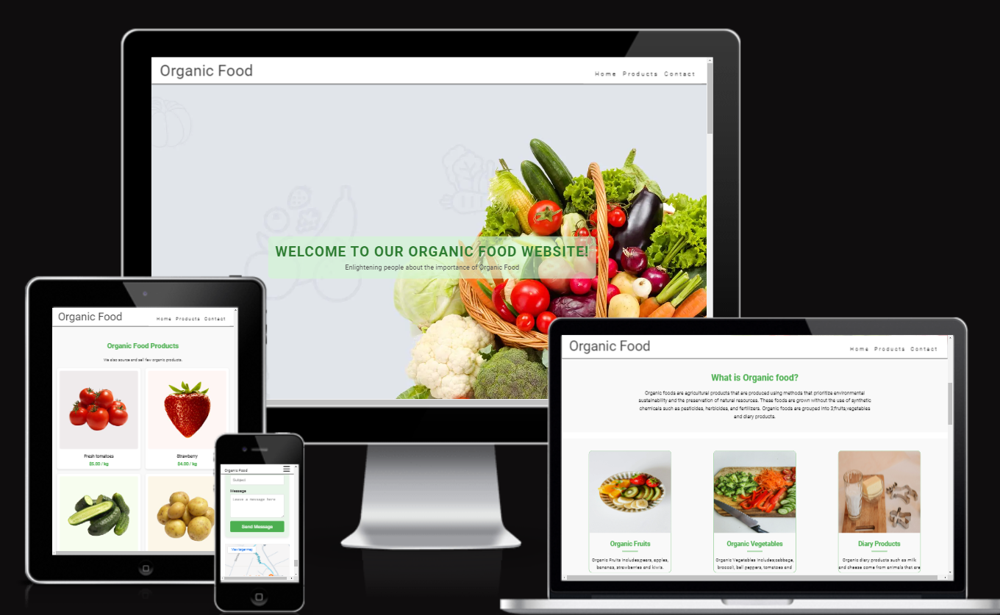

#
Organic Food
##
Our Organic Food Website is a single page website with three sections designed to enlighten users on healthy eating habits,it also educates users about the importance and benefits of organic foods whilst aiming at providing users with seamless experience in exploring and purchasing high quality organic food.The site features a home page with information on organic foods, a thank-you page for contact form submissions, and a custom 404 error page to guide users back if they encounter broken links.

###
Site Goals
-To inform users about the benefits of organic food and provide available products.
-To provide an easy-to-navigate user experience with a clear contact option.
-To offer a professional and responsive interface for desktop and mobile users.
-To ensure users can find relevant pages quickly using footer links.

Target Audience
-Health-conscious individuals and customers interested in organic food.
-Visitors seeking to inquire about what organic products are,its health benefits and where to source organic products.

####
Features
Existing Features
-Home Page:This page consists of the introduction to organic food and the definition aswell as the various categories of organic foods attaching images,examples,benefits and importance.
-A contact form allowing users to submit inquiries with required fields for name, email, subject, and message.
-Footer Links: Links to navigate to important sections of the website like the home page and contact information.
-Thank-You Page:A confirmation page displayed after the user submits the contact form, thanking them for their message.
404 Error Page:A custom error page with a friendly message and a "Go Back to Home" button for users who land on non-existent pages.

Future Features
Product Filtering: A filter or search option for users to easily find specific products.
Testimonials: A section for customer testimonials to build trust and engagement.
Newsletter Subscription: Allow users to sign up for email updates on organic food products.

Existing Features
Future Features
Design
Color Scheme
Typography
Imagery
Technologies Used
Testing
Deployment
Live Site
Local Deployment
Credits
Content
Media
Acknowledgements