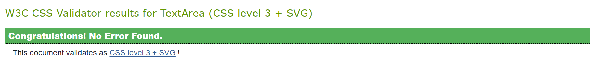

# Organic Food

##
Our Organic Food Website is a single page website with three sections designed to enlighten users on healthy eating habits,it also educates users about the importance and benefits of organic foods whilst aiming at providing users with seamless experience in exploring and purchasing high quality organic food.The site features a home page with information on organic foods, a thank-you page for contact form submissions, and a custom 404 error page to guide users back if they encounter broken links.

### Site Goals                                            
- To inform users about the benefits of organic food and provide available products.                                         
- To provide an easy-to-navigate user experience with a clear contact option.                                               
- To offer a professional and responsive interface for desktop and mobile users.                                                                                                              
- To ensure users can find relevant pages quickly using footer links.

### Target Audience                                        
- Health-conscious individuals and customers interested in organic food.                                                     
- Visitors seeking to inquire about what organic products are,its health benefits and where to source organic products.                                           

### User Goals

#### First time Visitors Goals:        
- As a visitor, I want to learn about the benefits of organic food so I can make better choices for my health.                                               
- I want to view a selection of organic products offered by the website.                                            
- I want to contact the website owners for further inquiries.      
- I want to view the business location on a map (iframe).                           
#### Returning Visitor Goals:                           
- I want to re-access the product section to browse organic items.                                       
- I want to submit another inquiry using the contact form.                                      
#### Error Handling Goals:                       
As a visitor who navigates to a broken or incorrect URL, I want to be redirected to a helpful 404 page with a link back to the home page.

### Features                                            
- Home Page*:This page consists of the introduction to organic food and the definition aswell as the various categories of organic foods attaching images, examples, benefits and importance.
                                                                                                                                                                                                       
- A contact form allowing users to submit inquiries with required fields for name, email, subject, and message.                                                          
- Iframe Section: Displays the location of the business in Nottingham, England, using a Google Maps iframe embedded on the home page.  
                                      
- Social media Icons: footer section includes Icons to the relevant social media sites for Organic food Website.                                            
- Thank-You Page:A confirmation page displayed after the user submits the contact form, thanking them for their message.                                                                    
- 404 Error Page:A custom error page with a friendly message and a "Go Back to Home" button for users who land on non-existent pages.

#### Future Features                                  
- Testimonials: A section for customer testimonials to build trust and engagement.                                          
- Newsletter Subscription: Allow users to sign up for email updates on organic food products.                         

#### Design:
Color Scheme:     
- The website uses a palette of natural, earthy tones like shades of green (#2d8659) (#4CAF50), black, and white, symbolizing health and nature.   
- Typography
Headings: "roboto", sans-serif – to evoke a rustic, organic feel.
Body Text: 'roboto', sans-serif – for clean, modern readability.    
- Imagery
Images of fresh organic food and natural landscapes are used throughout the site to promote a clean and healthy lifestyle.

Wireframes were created to plan the layout and structure of the website before development.

Technologies Used:                                   
Languages                                           
-HTML5: Used for the structure of the website.       
-CSS3: Used for styling and making the website responsive across different devices.               

Tools & Libraries:   
Google Fonts: For typography.                    
Font Awesome: For icons used in the footer and the burger menu.   
Git: For version control.                   
GitHub Pages: For hosting the live website.
### Manual Testing

| Feature | Action | Expected Result | Actual Result| Pass/Fail
| ------------- | ------------- | ------------- | ------------- |  ------------- |
| Home link| Click on home link | Navigate to the position on the page where the home is featured | Navigated to the position on the page where the home is featured | Pass |

| Feature | Action | Expected Result | Actual Result| Pass/Fail
| ------------- | ------------- | ------------- | ------------- |  ------------- |
| Product link | Click on the product link | Navigate to the position on the page where the product section is featured | Navigated to the position on the page where the product section is featured | Pass |

| Feature | Action | Expected Result | Actual Result| Pass/Fail
| ------------- | ------------- | ------------- | ------------- |  ------------- |
| Contact link | Click on the contact link | Navigate to the position on the page where the contact section is featured | Navigated to the position on the page where the contact section is featured | Pass |

| Feature | Action | Expected Result | Actual Result| Pass/Fail
| ------------- | ------------- | ------------- | ------------- |  ------------- |
| thank-you | Click on the send message button | Redirect user to a thank you page | Redirected user to a thank you page | Pass |

| Feature | Action | Expected Result | Actual Result| Pass/Fail
| ------------- | ------------- | ------------- | ------------- |  ------------- |
| Go Back to Home | To Redirect user back to home page | Redirect user back to home page | Redirected user back to home | Pass |

| Feature | Action | Expected Result | Actual Result| Pass/Fail
| ------------- | ------------- | ------------- | ------------- |  ------------- |
| Footer links | Click on the footer icon | Navigate to the respective social media website | Navigated to the social media website | Pass |

#### Home Page

Verified that the product section and contact form are visible and functioning correctly on all screen sizes.
Ensured all footer links navigate to the correct sections.

#### Contact Form
Verified that the form fields are working as expected (e.g., required fields, valid email input).
After form submission, users are redirected to the Thank-You page.

#### 404 Error Page
Tested broken and incorrect URLs to confirm that the 404 page displays and the "Go Back to Home" button functions properly.                                          

#### Responsive Testing
The website was tested on multiple devices (desktop, tablet, mobile) using Chrome Developer Tools and confirmed to be fully responsive.          

#### Validator Testing:                                   
HTML: Passed validation with the W3C HTML Validator.                                         
 ![W3C-Validator]https://validator.w3.org/nu/#textarea    
   
CSS: Passed validation with the W3C CSS Validator.![Css] https://jigsaw.w3.org/css-validator/validator                                              
#### Browser Compactibility
The website was tested on different browsers(chrome, firefox and safari) to ensure compactibility

#### Accessibility
The website was tested using light house to ensure accessibility ,it achieved a good score for Accessibility, Best practises and SEO. 

#### Performance
The image was optimized using TinyPNG and light house reports were run to check the load time.       
#### Links Testing
All internal and external links were tested to ensure they direct to the correct page and open in new tabs.

### Deployment
The site was deployed to GitHub pages.
 The steps to deploy are as follows:      
-In the GitHub repository, navigate to the Settings tab     
-From the source section drop-down menu, select the Master Branch      
Once the master branch has been selected, the page will be automatically refreshed with a detailed ribbon display to indicate the successful deployment.              
The live link can be found here - https://mildred-prog.github.io/Organic-Food/

#### Citation of ALL sources(code, 
images, text)

Credits

Acknowledgements

bug found
-fixed the bug found in the product section coverong the line ahead